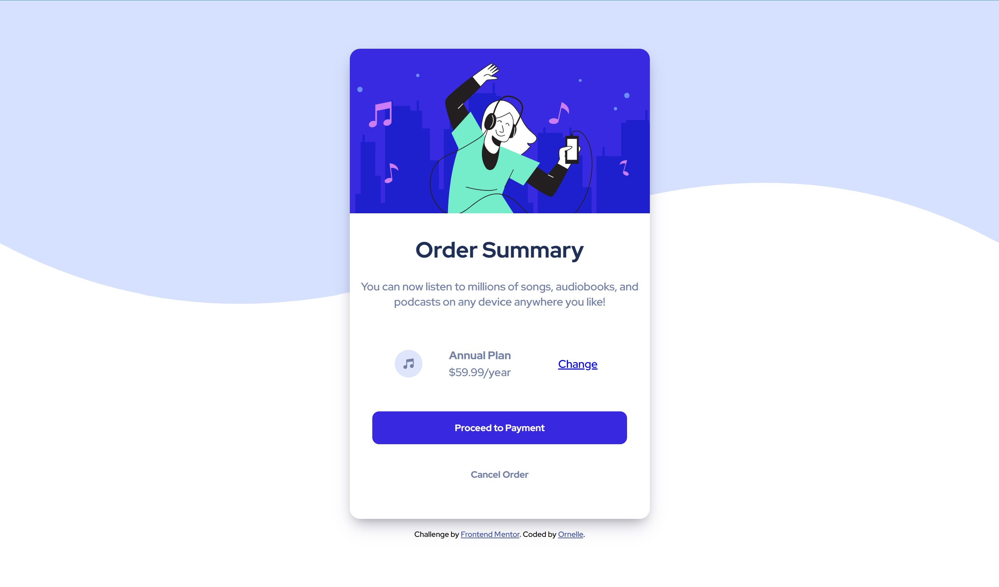

# Frontend Mentor - Order summary card solution

This is a solution to the [Order summary card challenge on Frontend Mentor](https://www.frontendmentor.io/challenges/order-summary-component-QlPmajDUj). Frontend Mentor challenges help you improve your coding skills by building realistic projects. 

## Table of contents

- [Overview](#overview)
  - [The challenge](#the-challenge)
  - [Screenshot](#screenshot)
  - [Links](#links)
- [My process](#my-process)
  - [Built with](#built-with)
  - [What I learned](#what-i-learned)
  - [Continued development](#continued-development)
  - [Useful resources](#useful-resources)
- [Author](#author)
- [Acknowledgments](#acknowledgments)

## Overview

### The challenge

Users should be able to:

- See hover states for interactive elements

### Screenshot

### Links
- Live Site URL: [github page](https://blackysynch.github.io/results-summary-component-main/)

## My process

### Built with

- Semantic HTML5 markup
- CSS custom properties
- Flexbox
- CSS Grid
- Mobile-first workflow
- [Styled shadows](https://getcssscan.com/css-box-shadow-examples) - For shadow

### Useful resources

- [Vertical and Horizontal centering](https://stackoverflow.com/questions/11978231/vertically-center-two-elements-within-a-div/31977476#31977476) - These comments helped me understand the centering of elements.
- [shadow](https://getcssscan.com/css-box-shadow-examples) - This is a great site which helped me understand shadows. I'd recommend it to anyone needing shadow styles.

## Author

- Frontend Mentor - [@Blackysynch](https://www.frontendmentor.io/profile/Blackysynch)
- Twitter - [@ornelle_o](https://twitter.com/ornelle_o)
